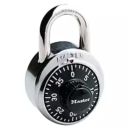

[](https://classroom.github.com/a/L2YaebSO)
[](https://classroom.github.com/online_ide?assignment_repo_id=11897187&assignment_repo_type=AssignmentRepo)
# Kotlin Problem 2

Now that you’re back to school for another term, you need to remember how to work the combination lock on your locker.
The lock has a dial with 40 calibration marks numbered 0 to 39 in clockwise order.
A combination of this lock consists of 3 of these numbers; for example: 15-25-8.



To open the lock, the following steps are taken:

```
1. Turn the dial clockwise 2 full turns
2. Continue turning clockwise until the 1st number is reached
3. Turn the dial counter-clockwise 1 full turn
4. Continue turning counter-clockwise until the 2nd number is reached
5. Turn the dial clockwise again until the 3rd number is reached
6. Pull the shank and the lock will open.
```

Given the initial position of the dial and the combination for the lock,
how many degrees is the dial rotated in total (clockwise plus counter-clockwise) in opening the lock?

### Input

There is a line of input containing 4 numbers between 0 and 39.
The first number is the position of the dial.
The next three numbers are the combination.
Consecutive numbers in the combination will be distinct.

### Output

Return the number of degrees that the dial must be turned to open the lock.
A few examples are:

```
degreesOfLock(0, 30, 0, 30) -> 1350
degreesOfLock(5, 35, 5, 35) -> 1350
degreesOfLock(0, 20, 0, 20) -> 1620
degreesOfLock(7, 27, 7, 27) -> 1620
degreesOfLock(0, 10, 0, 10) -> 1890
degreesOfLock(9, 19, 9, 19) -> 1890
```

### Test Cases

See ``src/test/kotlin/SolutionTest.kt``
